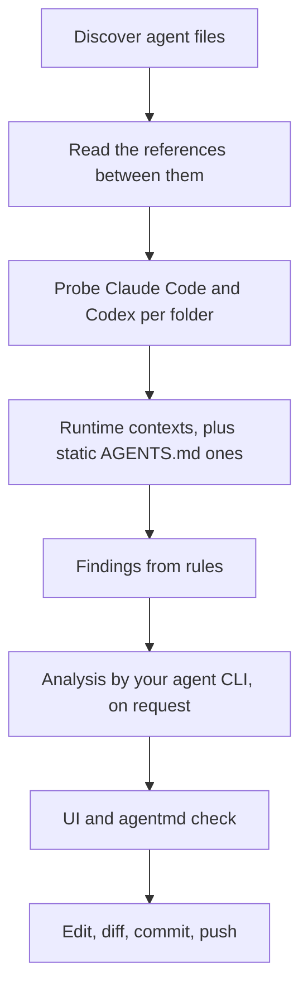
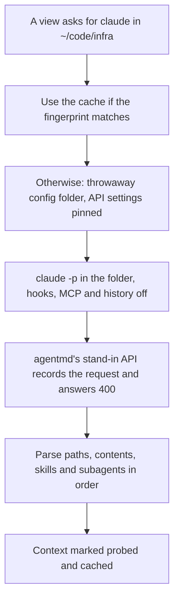
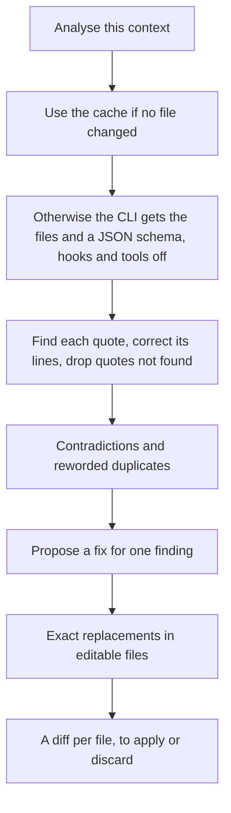
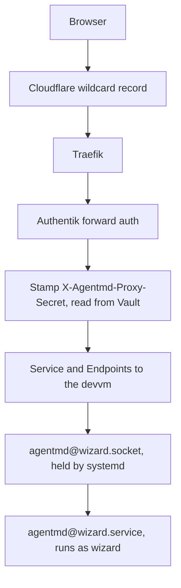

# agentmd v1: see, check and edit the files your agents read

Date: 2026-09-26. Owner: Viktor. Glossary: [CONTEXT.md](https://forgejo.viktorbarzin.me/viktor/agentmd/src/branch/master/CONTEXT.md).
Decisions: [ADR-0001](https://forgejo.viktorbarzin.me/viktor/agentmd/src/branch/master/docs/adr/0001-runtime-context-comes-from-probing-the-harness.md),
[ADR-0002](https://forgejo.viktorbarzin.me/viktor/agentmd/src/branch/master/docs/adr/0002-localhost-without-a-token.md),
[ADR-0003](https://forgejo.viktorbarzin.me/viktor/agentmd/src/branch/master/docs/adr/0003-analysis-runs-through-the-installed-agent-cli.md).

## Goal

A coding agent reads instructions from many places: an org policy, a user file,
one file per repository and sometimes one per subfolder, plus skills, subagents,
commands and the docs they point to. Symlinks, build steps and imports tie these
together, and it is hard to see from any one file what an agent actually loads
in a given folder, what repeats, and what disagrees.

agentmd is one small program that finds these files, draws how they refer to
each other, reports duplicates, contradictions and other findings, and lets the
owner edit the files in a browser. It is generic: anyone can download one binary
and run it on their machine. The homelab runs one instance per devvm user behind
Authentik.

```stats
~300 | agent files on the devvm for one user
0.5 s | to walk ~/code for them
3 | harnesses: Claude Code, Codex, AGENTS.md
1 | binary, UI included
```

## What shipped

Status on 2026-09-26: built, released and deployed.

- Release [v0.1.1](https://github.com/ViktorBarzin/agentmd/releases/tag/v0.1.1)
  (v0.1.0 plus two fixes found on the live instance, below), binaries for linux
  and darwin on amd64 and arm64.
- Viktor's instance runs as `agentmd@wizard` behind Authentik at
  `agentmd.viktorbarzin.me`. On the devvm it finds 568 files and 124 probed
  contexts, with 37 problems and 81 hints; a full re-probe of 63 contexts took
  36 s, and the instance holds about 25 to 35 MB.
- Tests: 174 UI tests, the Go suite (including live probes of the real CLIs
  against a hostile repository), and a Playwright test that opens a file
  through its `CLAUDE.md` link, edits, saves, commits and pushes. CI on the
  GitHub mirror runs all of them.

Found on the live instance and fixed in v0.1.1:

- Claude's feature-flag values changed within half an hour, which made every
  Claude probe stale and the UI re-probe everything on each open. Only the flags
  that concern instruction files, imports and skills count now.
- The instance held 110 MB, almost all of it short-lived memory from scans. It now hands
  memory back after each scan.

Found on the live instance a week later and fixed in v0.1.3:

- A skill description can run over several lines in Claude Code's skill list,
  and the probe stopped reading the list at the first such line, so a context
  showed 6 of its 52 skills. Plugin skills also lost their prefix.
- agentmd read the harness versions once, at start. A harness that updated
  itself while agentmd ran kept its old version in the UI and never marked the
  probes it had made stale.
- The fingerprint used modification times. Codex rewrites its bundled skills
  on its first run after an update, which left the rest of that probe batch
  stale. The fingerprint now hashes content, and a batch probes once more any
  context it left stale.
- The UI showed the state from agentmd's last scan, which could be days old,
  and chose what to probe from it. Opening the UI now scans first.

Found while checking v0.1.3 on the live instance and fixed in v0.1.4:

- Claude Code lists custom commands with its skills, and agentmd matched those
  names only against skill files, so a repository's commands showed as skills
  without a file.

Fixed in v0.1.5: the v0.1.4 fix showed only for contexts probed after the
upgrade, because a cached probe keeps the names and links the old code worked
out. The fingerprint now names agentmd's probe format, so an upgrade that
reads probes differently probes everything again once.

## What we checked before designing

Each row was measured on the devvm on 2026-09-26 with Claude Code 2.1.283 and
Codex 0.157.1. Two independent reviewers then tried to break the first draft;
the rows marked "review" come from their findings, reproduced before they were
adopted.

| question | result |
|---|---|
| Can a Claude probe record the runtime context without a model? | Yes. `claude -p` against a local stand-in API sent one message request (after a `HEAD` connectivity check). It named each instruction file with its path in load order (org policy, `~/.claude/CLAUDE.md`, `~/code/CLAUDE.md`, `~/code/infra/CLAUDE.md`), listed 53 skills by name and 24 subagents with descriptions. |
| Does `disableAllHooks` in `--settings` stop hooks? | The user's own hooks did not run (traced with `strace`). The two hooks from the org policy ran anyway. They do nothing outside tmux, so the probe unsets `TMUX`. |
| Can a repository's own settings take over a probe? (review) | Yes. With the first draft's flags, a repository's `.claude/settings.json` ran its `apiKeyHelper` command and redirected the request to its own server. Pinning the API address, key and helper settings in the probe's own `--settings` stopped both, and the project `CLAUDE.md` still loaded. `--setting-sources user` also stops it, but drops the project `CLAUDE.md`, so it is not used. |
| Does a probe write to the owner's state? (review) | Yes, each run rewrote `~/.claude.json` (436 KB). With `CLAUDE_CONFIG_DIR` pointing at a throwaway folder of symlinks plus a copy of `~/.claude.json`, the probe captured the same files, skills and subagents and left `~/.claude.json` untouched. |
| Does a probe start MCP servers? | Claude: yes, unless `--strict-mcp-config`. Codex (review): `codex debug prompt-input` connected to two MCP servers. `-c mcp_servers={}` did not stop it; `-c mcp_servers.<name>.enabled=false` for each configured server did. |
| Can Codex report its runtime context? | Yes. `codex debug prompt-input` prints JSON. The user file and project docs arrive as one block with no per-file paths, so agentmd matches file contents in order. Skills come as short paths plus a table of skill roots. |
| Does analysis work without loading the owner's own instructions? | Yes. `claude -p --setting-sources ""` loaded only the org policy, still used the normal login, and returned the schema's JSON in `structured_output` in 8 s. |
| Does analysis leak file contents to telemetry? | The devvm logs each prompt to Loki. With the files in `--system-prompt-file` and a one-line prompt, a canary inside the files appeared in none of the session's events. |
| How many files, and how long does discovery take? | 204 agent files under `~/code` (139 skills, 25 `AGENTS.md`, 22 `CLAUDE.md`), found in 0.5 s. The user's skills and 45 plugin skills add the rest. |

## How it works



## Discovery

agentmd looks in two kinds of places.

1. **Harness locations**, per harness:

   | harness | org | user | project (per directory) |
   |---|---|---|---|
   | Claude Code | `/etc/claude-code/CLAUDE.md`, the `claudeMd` field of `managed-settings.json`, `/etc/claude-code/.claude/rules/` | `~/.claude/CLAUDE.md`, `rules/`, `skills/`, `agents/`, `commands/`, plugin skills and agents | `CLAUDE.md`, `CLAUDE.local.md`, `.claude/CLAUDE.md`, `.claude/{rules,skills,agents,commands}/` |
   | Codex | the `additional_developer_instructions` field of `/etc/codex/requirements.toml` | `$CODEX_HOME/AGENTS.md`, `AGENTS.override.md`, `prompts/`, `~/.agents/skills/`, `$CODEX_HOME/skills/` | `AGENTS.md`, `AGENTS.override.md`, fallback names from `config.toml`, `.agents/skills/` |
   | AGENTS.md | none | none | `AGENTS.md` |

   macOS uses its own managed paths. Fields inside settings files become embedded
   files.

2. **Discovery roots**: directory trees searched for the project files above,
   `~/code` by default. The walk skips `.git`, `.worktrees` and other hidden
   folders (except `.claude`, `.agents` and `.codex`), `node_modules`, `vendor`,
   build output and virtualenvs, plus any patterns in the config.

Referenced docs join the set one hop out: a markdown file that an agent file
mentions by path, links or imports becomes a node even when it lives elsewhere.

Each file records who can edit it and where edits belong:

| situation | how agentmd tells | what the editor does |
|---|---|---|
| symlink | `lstat` | edits the target and shows every path that reaches it |
| built file | a "built from" header comment, or a `[[build]]` entry in the config | opens read-only with buttons for each part |
| owned by root or not writable | file permissions | read-only; names the origin when the config declares one, and the origin opens for editing |
| managed by chezmoi | `chezmoi managed` | editable, with a note naming the source file |
| skill from an installer | the skills lockfile | editable, with a warning that the next update replaces it |
| plugin file | under the plugins directory | read-only; edits would be lost on the next plugin update |

## References

| kind | found from |
|---|---|
| symlink | `readlink` on every discovered path, including symlinked skill directories |
| build join | "built from" headers (with brace expansion, as in `~/.agents/{core,personal}.md`), `[[build]]` config entries, `[[origin]]` config entries for copies installed elsewhere, and Claude `@path` imports outside code |
| text mention | markdown links and paths in code spans or plain text that resolve to a markdown file, tried relative to the file, its repository, the discovery root and `~`; `/name` and `` `name` skill `` resolve to skills |
| load order | consecutive files in a runtime context |

A reviewer measured the first rule on 231 files: 49% of path-like mentions
resolved to nothing, mostly slash commands, URL routes and example paths. So a
mention counts as a dangling reference only when all of these hold: it names a
markdown file, it is outside a fenced code block, it has no placeholder such as
`<user>` or `*`, and the folder it points into exists. That keeps a real break
such as a renamed `~/.claude/rules/30-planning.md` and drops
`/assets/page.css` or `path/to/doc.md`.

## Runtime contexts and probes

A context is identified by harness and directory. agentmd builds contexts for
the home directory, every repository root, and every directory inside a
repository that holds an instruction file. Claude Code and Codex contexts come
only from probes; a directory that has not been probed says so, and agentmd does
not guess. The AGENTS.md standard has no program to probe, so it uses static
rules: every `AGENTS.md` from the repository root down to the directory.



**Claude Code.**

- Command: `claude -p "agentmd probe" --output-format json
  --no-session-persistence --strict-mcp-config --settings <pins>`, with stdin
  from `/dev/null` and no terminal-multiplexer variables.
- The pins are `disableAllHooks`, empty `apiKeyHelper`, `otelHeadersHelper`,
  `awsAuthRefresh` and `awsCredentialExport`, and an `env` block that sets the
  stand-in's address, a placeholder key, an empty auth token, and switches off
  the Bedrock, Vertex and Foundry providers.
- `CLAUDE_CONFIG_DIR` points at a throwaway folder that links every entry of
  `~/.claude` except state folders (projects, history, snapshots, todos,
  backups), with a copy of `~/.claude.json`. The probe therefore sees the same
  trust decisions, import approvals and feature flags, and writes nothing to the
  owner's state. Paths inside the throwaway folder map back to `~/.claude`.
- agentmd refuses to probe when the org policy itself routes Claude elsewhere:
  a base URL, a key helper or a third-party provider set by managed settings. It
  also treats "the stand-in saw no message request" as an error.
- Parsed from the recorded request: the `Contents of <path> (<description>):`
  blocks, the skills list and the subagent list.

**Codex.**

- Command: `codex debug prompt-input "agentmd probe"` in the directory, with
  `-c mcp_servers.<name>.enabled=false` for every server in `config.toml` and
  its profiles.
- Attribution: the trimmed user file is matched first, then each candidate
  project doc in order (`AGENTS.override.md`, `AGENTS.md` or a fallback name,
  from the git root down). The last match may be a cut-off prefix, which is how
  agentmd finds where the 32,768-byte budget cut a file. Docs after the cut are
  reported as not loaded. agentmd never splits on the `--- project-doc ---`
  marker, since a doc may contain that text.
- Skills come from the roots table and `(file: r0/...)` entries; the org policy
  from its developer message.

**Cache.** The key is the harness version, read again on every scan, plus a
fingerprint of everything that could change the result:

- agentmd's probe format, which changes with its parsers and with how it maps
  names to files, so an upgrade that reads probes differently probes again;
- a content hash of the org and user files, and of each settings file
  (`settings.json`, `settings.local.json`, managed settings, the project's
  `.claude/settings*.json`, Codex `config.toml`);
- every `SKILL.md`;
- the instruction files up the tree from the directory, including the ones that
  do not exist yet, so creating a `CLAUDE.md` invalidates the result;
- the files the previous probe loaded (imports included);
- a hash of the relevant `~/.claude.json` entries: the trust and import-approval
  flags for the directory and its parents, and the cached feature flags that
  concern instruction files, imports and skills (about 8 of 724). The rest
  change several times an hour, and hashing them all made every probe stale
  within minutes.

The fingerprint hashes content rather than modification times, because
harnesses and updaters rewrite files without changing them. Codex unpacks its
bundled skills again on its first run after an update, which also changes the
inputs of the probes made before it, so a batch of probes checks its results
and probes once more any context it left stale.

Probes run when a view or `agentmd check --probe` asks for them, four at a
time. The UI probes every context on first open, with progress, and afterwards
re-probes only stale ones. A Claude probe takes 2.5 to 4 s and a Codex probe
about 3.4 s, so the first full run on the devvm is about a minute.

## Findings

| finding | how | problem when |
|---|---|---|
| duplicate | shared runs of 8 normalised words across two files, merged into passages, with line ranges on both sides | both files co-load |
| reworded duplicate | analysis | the files co-load |
| contradiction | analysis | the files co-load |
| dangling reference | a mention, import or symlink whose target is missing (mentions filtered as above) | it is a symlink or an import in a loaded file, which drops text without a warning |
| over budget | Codex project docs past `project_doc_max_bytes` (32,768 by default; Codex cuts the text), a Claude instruction file past 40,000 characters (Claude Code warns but sends it), or a file past the owner's own budget | always |
| not loaded | an instruction file that a probed context in its directory skips, such as an `AGENTS.md` Claude Code ignores because a `CLAUDE.md` sits further up | never: a hint naming the harness and the reason when known |

Every other duplicate is a hint, for example the same paragraph in two
unrelated repositories. Pairs that are the same file through a symlink, a built
file against its own parts, and an installed copy against its origin are not
findings. Repeats inside one file are left out: a reviewer found them in 22 of 51
instruction files, and the sampled ones were tables of contents.

## Editing

- The editor is CodeMirror 6 with markdown highlighting, findings in the gutter,
  and a side-by-side mode that opens both halves of a duplicate at their line
  ranges.
- **Save** sends the content with the hash it was loaded at. If the file changed
  on disk since then, the save stops and shows the difference. Otherwise
  agentmd writes a temporary file next to the real path and renames it over,
  keeping the mode, and writes through symlinks to the target.
- **Embedded files** save by replacing only that field's string in the settings
  file, keeping the rest of the file's bytes. The new string is encoded in the
  file's own style: literal UTF-8 and no HTML escaping when the file has none.
- After a save the UI shows the file's `git diff`.
- **Commit** is optional: a message box runs `git add` and `git commit` on those
  paths only, with the owner's identity and hooks.
- **Push** is optional after a commit. It only fast-forwards the current branch
  to its upstream, and reports git's refusal as it is (for example when the
  branch is behind or protected). agentmd never rebases, merges or force-pushes.

## Analysis and fix proposals



- Claude: `claude -p "<one line>" --output-format json --json-schema <schema>
  --setting-sources "" --settings '{"disableAllHooks":true}'
  --no-session-persistence --strict-mcp-config --tools ""
  --disable-slash-commands --system-prompt-file <files>`. Only the org policy
  loads alongside the files, and the files stay out of prompt telemetry.
- Codex: `codex exec --ephemeral --skip-git-repo-check --sandbox read-only
  --output-schema <schema> -o <answer>` with the material on stdin and MCP
  servers switched off as in the probe.
- A built file is replaced by its parts in the input when each part is found
  verbatim in it, so findings and fixes point at the files the owner edits.
- A fix proposal is a list of exact search-and-replace edits. Each search text
  must appear once in its file, or the proposal is rejected with the reason.
- The owner's CLI settings decide the model and cost. The analysis button shows
  which CLI will run.

## The UI

One page, built with Svelte 5 and embedded in the binary.

- **Top bar**: search, a harness filter, and a context picker (harness and
  directory). Picking a context filters every view to what loads there and in
  which order.
- **Files**: a tree grouped as org, user, skills and each repository, with badges
  for findings, harness load markers, and symbols for links, built, read-only and
  managed files.
- **Graph**: cytoscape.js with one node per file, coloured by kind, and the four
  reference kinds as toggles. With a context picked, the load order shows as
  numbered edges and everything else dims. Symlink nodes can be collapsed into
  their targets.
- **Findings**: a table of problems first, then hints, filterable by kind,
  harness and file. Each row opens the editor at the span, or both files side by
  side. The analysis button per context and the fix button per finding live here.
- **Editor**: opens from any view, in a panel or full width.

## The CLI

```text
agentmd                       same as agentmd serve
agentmd serve [--listen 127.0.0.1:7390] [--open]
              [--proxy-secret-file F --identity-header H --allow-identity NAME ...]
agentmd check [--json] [--probe] [--analyse] [--dir D] [--harness H] [--fail-on problem|hint|none]
agentmd probe --harness claude|codex|agents-md --dir D [--json]
agentmd version
```

`check` prints findings as text, or the whole model as JSON for agents and CI,
and exits 1 when findings at or above `--fail-on` exist (default `problem`).
Without `--probe`, it uses cached probes and reports unprobed contexts as such.

## Access

As [ADR-0002](https://forgejo.viktorbarzin.me/viktor/agentmd/src/branch/master/docs/adr/0002-localhost-without-a-token.md) records:

- The default listens on `127.0.0.1:7390` with no token. The server answers only
  a loopback `Host`, requires `X-Agentmd-Request: 1` on every `/api` call (probes
  and analysis start processes and spend the owner's plan), never sends CORS
  headers, and on Linux refuses connections whose socket belongs to another OS
  user. A relay the owner runs themselves counts as the owner.
- Any other listen address needs `--proxy-secret-file`. Every request must then
  carry that secret in `X-Agentmd-Proxy-Secret` (compared in constant time), and
  the identity header must name an allowed identity (default: the OS user name).
- `serve` accepts a listening socket from systemd, so a service manager can hold
  the port while agentmd restarts.
- The process acts as the user who started it. It never changes user.

## Configuration

Optional, in `~/.config/agentmd/config.toml`, plus `/etc/agentmd/config.toml`
for machine-wide entries. Both are merged.

```toml
roots = ["~/code"]
exclude = ["**/fixtures/**"]

[budget]
file_bytes = 32768             # the owner's own limit per instruction file

[analysis]
cli = "claude"                 # or "codex"

[[origin]]                     # a root-owned copy and where to edit it
path = "/etc/claude-code/managed-settings.json"
field = "claudeMd"
source = ["~/code/infra/scripts/workstation/managed-settings.json"]
note = "Installed on every devvm user within the hour after it lands on master"

[[build]]                      # a built file and its parts
output = "~/.agents/AGENTS.md"
parts = ["~/.agents/core.md", "~/.agents/personal.md"]
command = "agents-sync"

[[harness]]                    # an extra static harness, for example Pi
name = "pi"
user_files = ["~/.pi/agent/AGENTS.md"]
project_files = ["AGENTS.md"]
skill_dirs = ["~/.agents/skills"]
```

## Storage, side effects and resource use

- Probe and analysis results live in `~/.cache/agentmd` (mode 0700), keyed by
  content hash, next to the throwaway Claude config folders, which are removed
  after each probe.
- A Codex probe writes Codex's own cache files in `$CODEX_HOME`, as any Codex
  run does. Each probe and analysis is a short harness session, so an org that
  records sessions sees them; the probe prompt is "agentmd probe".
- No background work: no file watchers and no timers. A scan runs at start,
  when the UI opens, on the rescan button and when the browser tab regains
  focus. On the devvm a scan
  takes about half a second.
- A Go binary with the UI embedded. On the devvm a scan keeps about 8 MB and
  makes about 220 MB of short-lived allocations, which agentmd hands back to the
  system after each scan.

## Repository and releases

- Forgejo `viktor/agentmd`, public, with a push mirror to GitHub
  `ViktorBarzin/agentmd`, the same arrangement as terminal-lobby.
- GitHub Actions on the mirror runs `go test`, `go vet`, `svelte-check`,
  `vitest` and a build on every push, and GoReleaser on `v*` tags publishes
  binaries for linux and darwin on amd64 and arm64 with checksums. No in-cluster
  CI.
- Semver: this release is `v0.1.0`.
- MIT licence. Tests and fixtures use made-up files, never real instruction
  files. The live test includes a hostile repository whose settings try to run a
  command and redirect the probe.

## Homelab deployment

Lives in the infra repository, outside this one.



- **infra stack `stacks/agentmd`**, shaped like `stacks/t3code`: a namespace, a
  Service and Endpoints to the devvm port, `ingress_factory` with
  `auth = "required"` and `dns_type = "proxied"`, and a headers middleware
  holding the proxy secret read from Vault. The shared forward-auth middleware
  runs before it, so the identity header comes from Authentik.
- **devvm playbook**:
  - installs the pinned release with its checksum into `/usr/local/bin`;
  - writes the secret to a root-only file that the unit loads with
    `LoadCredential=`;
  - installs `agentmd@.socket`, with a per-user drop-in for the port, and
    `agentmd@.service` with `User=%i`, `HOME`, a `PATH` that includes
    `~/.local/bin` (where `claude` lives), `MemoryMax` with no swap and
    `OOMPolicy=continue`, as `t3-serve@` does;
  - writes a per-user environment file naming the user's Authentik identity,
    which differs from the OS user name.
- **Machine-wide config** `/etc/agentmd/config.toml` declares the org policy
  origins, since every devvm user shares them.
- **Secret**: a new random value in Vault, read by both the stack and the
  playbook, as with the terminal lobby's proxy secret. The stack is applied
  first, so the header arrives before the service starts asking for it.
- **More users later**: each one gets their own port, secret, middleware and
  hostname. One Service with two endpoints would spread one user's requests
  across both instances.

## Testing and verification

- Go tests are written first and table-driven, with property tests where a rule
  holds for all inputs (embedded-field edits round-trip, duplicate passages are
  symmetric). Fixtures build a fake home and fake repositories in a temp
  directory.
- Probe parsers are tested against synthetic recordings shaped like the real
  ones, and fake `claude` and `codex` scripts exercise the runners. A live test
  behind `AGENTMD_LIVE=1` runs the real CLIs in a temp tree, including the
  hostile repository.
- UI logic has vitest tests. A Playwright test drives the built binary against a
  fixture tree: open a file, edit, save, see the diff, commit.
- Before calling it done: run `agentmd check` on the devvm and read the output,
  drive the real UI with a browser and read the screenshots, and after the
  deploy confirm that the public name redirects to Authentik, that the devvm port
  answers 401 without the secret, and 200 with it.

## Build order

1. Repository scaffold, CONTEXT.md, ADRs, this plan.
2. Model, discovery and references, with tests.
3. Contexts: AGENTS.md static rules, then the Claude and Codex probes, then the
   cache.
4. Deterministic findings and `agentmd check` and `probe`.
5. HTTP API and the access checks.
6. Editing: save, embedded fields, diff, commit, push, ownership notes.
7. Analysis and fix proposals.
8. The UI: shell, files, graph, findings, editor.
9. CI, GoReleaser, `v0.1.0`.
10. The homelab deployment, then verification on the live instance.

## Open questions

- The Claude probe records what a print-mode session loads. Interactive
  sessions may add parts that print mode leaves out. Instruction files matched
  in the tests so far, but that is a few directories on one version.
- The list of settings a probe must pin follows Claude Code releases. A new
  setting that runs a command would need adding; the live hostile-repository
  test is how we would notice.
- The analysis quality on large contexts (the biggest here is about 58,000
  characters) is untested. The quote check guards against invented findings,
  not against missed ones.
- Whether Codex has a switch like `--setting-sources ""` that keeps
  `$CODEX_HOME/AGENTS.md` out of an analysis run is not known yet.
