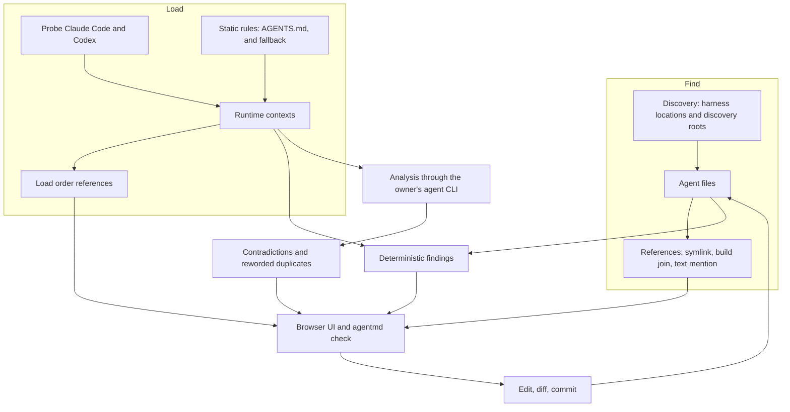
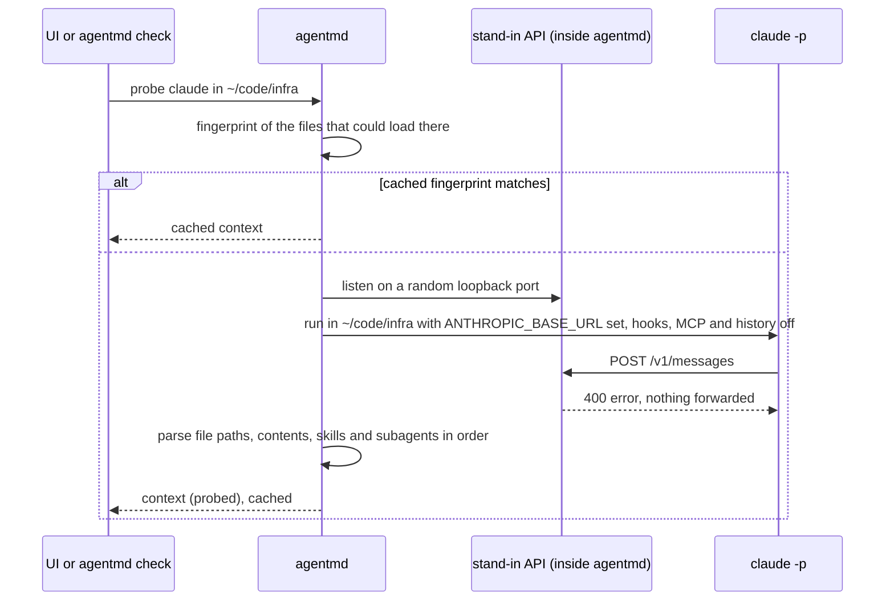
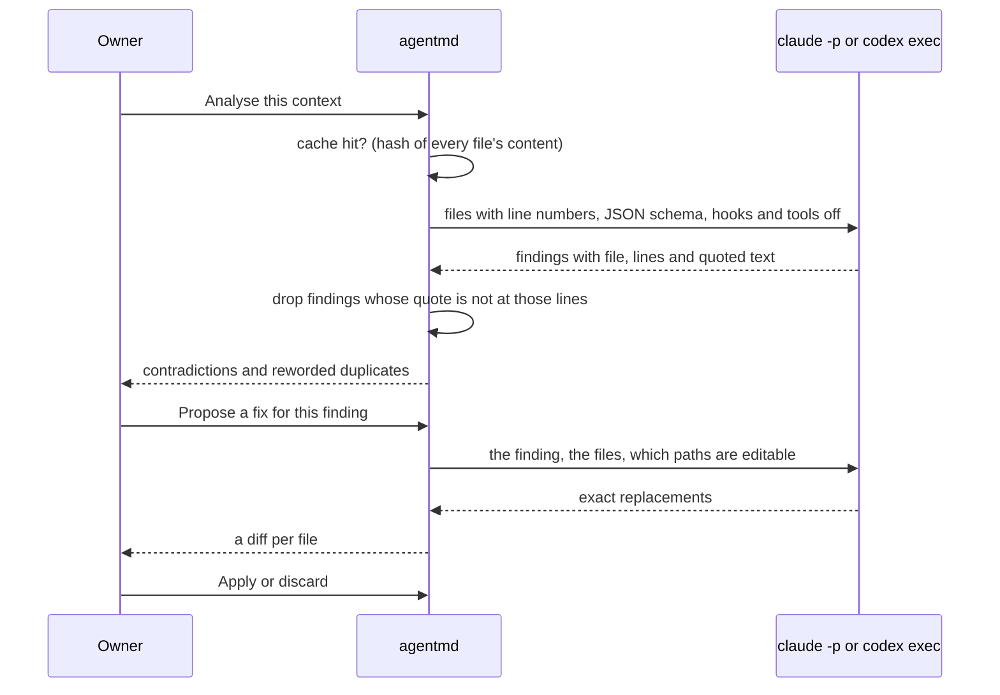
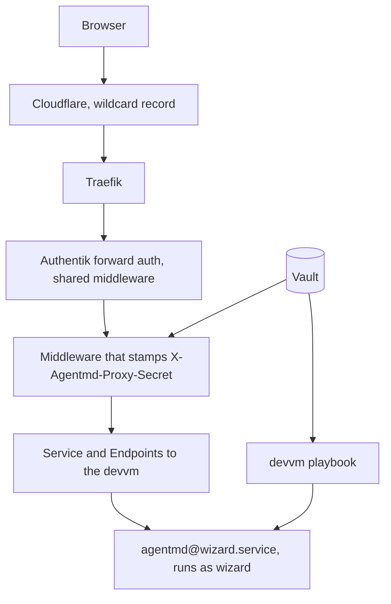

# agentmd v1: see, check and edit the files your agents read

Date: 2026-09-26. Owner: Viktor. Glossary: [CONTEXT.md](../../CONTEXT.md).
Decisions: [ADR-0001](../adr/0001-runtime-context-comes-from-probing-the-harness.md),
[ADR-0002](../adr/0002-localhost-without-a-token.md),
[ADR-0003](../adr/0003-analysis-runs-through-the-installed-agent-cli.md).

## Goal

A coding agent reads instructions from many places: an org policy, a user file,
one file per repository and sometimes one per subfolder, plus skills, subagents,
commands and the docs they point to. Symlinks, build steps and imports tie these
together, and it is hard to see from any one file what an agent actually loads
in a given folder, what repeats, and what disagrees.

agentmd is one small program that finds these files, draws how they refer to
each other, reports duplicates, contradictions and other findings, and lets the
owner edit the files in a browser. It is generic: anyone can download one binary
and run it on their machine. The homelab runs one instance per devvm user behind
Authentik.

```stats
~300 | agent files on the devvm for one user
0.5 s | to walk ~/code for them
3 | harnesses: Claude Code, Codex, AGENTS.md
1 | binary, UI included
```

## What we checked before designing

Each row was measured on the devvm on 2026-09-26 with Claude Code 2.1.283 and
Codex 0.157.1.

| question | result |
|---|---|
| Can a Claude probe record the runtime context without a model? | Yes. `claude -p` against a local stand-in API sent one request. It named each instruction file with its path in load order (org policy, `~/.claude/CLAUDE.md`, `~/code/CLAUDE.md`, `~/code/infra/CLAUDE.md`), listed 20 skills by name and the subagents with descriptions. |
| Does `disableAllHooks` in `--settings` stop hooks during the probe? | The user's own hooks did not run (traced with `strace`). The two hooks from the org policy ran anyway. They do nothing outside tmux, so the probe unsets `TMUX`. |
| Does a probe start MCP servers? | Yes, one Python MCP server started. `--strict-mcp-config` prevents it. |
| Can Codex report its runtime context? | Yes. `codex debug prompt-input` prints JSON. The user file and project docs arrive as one block joined by `--- project-doc ---`, with no per-file paths, so agentmd matches file contents to attribute it. Skills come with full paths. |
| How many files and how long does discovery take? | 204 agent files under `~/code` (139 skills, 25 `AGENTS.md`, 22 `CLAUDE.md`), found in 0.5 s. The user's skills and 45 plugin skills add the rest. |
| Do the LLM flags exist? | `claude -p` has `--json-schema`, `--output-format json`, `--tools ""` and `--disable-slash-commands`. `codex exec` has `--output-schema`, `--ephemeral` and reads the prompt from stdin. |

## How it works



## Discovery

agentmd looks in two kinds of places.

1. **Harness locations**, per harness:

   | harness | org | user | project (per directory) |
   |---|---|---|---|
   | Claude Code | `/etc/claude-code/CLAUDE.md`, the `claudeMd` field of `managed-settings.json`, `/etc/claude-code/.claude/rules/` | `~/.claude/CLAUDE.md`, `rules/`, `skills/`, `agents/`, `commands/`, plugin skills and agents | `CLAUDE.md`, `CLAUDE.local.md`, `.claude/CLAUDE.md`, `.claude/{rules,skills,agents,commands}/` |
   | Codex | the `additional_developer_instructions` field of `/etc/codex/requirements.toml` | `$CODEX_HOME/AGENTS.md`, `AGENTS.override.md`, `prompts/`, `~/.agents/skills/`, `$CODEX_HOME/skills/` | `AGENTS.md`, `AGENTS.override.md`, fallback names from `config.toml`, `.agents/skills/` |
   | AGENTS.md | none | none | `AGENTS.md` |

   macOS uses its own managed paths. Fields inside settings files become embedded
   files.

2. **Discovery roots**: directory trees searched for the project files above,
   `~/code` by default. The walk skips `.git`, `.worktrees`, `node_modules`,
   `vendor`, build output and virtualenvs, plus any patterns in the config.

Referenced docs join the set one hop out: a markdown file that an agent file
mentions by path, links or imports becomes a node even when it lives elsewhere.

Each file records who can edit it and where edits belong:

| situation | how agentmd tells | what the editor does |
|---|---|---|
| symlink | `lstat` | edits the target and shows every path that reaches it |
| built file | a "built from" header comment, or a `[[build]]` entry in the config | opens read-only with buttons for each part |
| owned by root or not writable | file permissions | read-only; names the origin when the config declares one, and the origin opens for editing |
| managed by chezmoi | `chezmoi managed` | editable, with a note naming the source file |
| skill from an installer | the skills lockfile | editable, with a warning that the next update replaces it |
| plugin file | under the plugins directory | read-only; edits would be lost on the next plugin update |

## References

| kind | found from |
|---|---|
| symlink | `readlink` on every discovered path, including symlinked skill directories |
| build join | "built from" headers, `[[build]]` config entries, `[[origin]]` config entries for copies installed elsewhere, and Claude `@path` imports |
| text mention | markdown links and paths in code spans or plain text that resolve to a file, tried relative to the file, its repository, the discovery root and `~` |
| load order | consecutive files in a runtime context |

A mention that looks like a path (it contains a slash and ends in a known
extension, or starts with `~/`, `./` or `/`) but resolves to nothing is kept as a
dangling reference. Paths with placeholders such as `<user>` or `*` are skipped.
Skill names in a code span next to the word "skill" resolve against the skills
that harness offers.

## Runtime contexts and probes

A context is identified by harness and directory. agentmd builds contexts for
the home directory, every repository root, and every directory inside a
repository that holds an instruction file.



- **Claude Code**: parsed from the `Contents of <path> (<description>):` blocks,
  the skills list and the subagent list in the recorded request. The probe runs
  with `--settings '{"disableAllHooks":true}' --no-session-persistence
  --strict-mcp-config`, a placeholder API key and no terminal-multiplexer
  variables.
- **Codex**: `codex debug prompt-input` in the directory. The instruction block
  is split on `--- project-doc ---`. Candidate files (the user file, then
  `AGENTS.md` from the git root down) are matched by content, which also finds
  where the 32,768-byte budget cut a file. Skills, org policy and paths come from
  their own sections.
- **AGENTS.md standard, and the fallback**: static rules. `AGENTS.md` from the
  repository root down to the directory. When `claude` or `codex` is missing, a
  simple static model stands in for it, and the context is labelled static.

The cache key is the harness version plus a fingerprint (path, size, mtime) of
every file that could load in that directory: the org and user files, the
instruction files in its ancestors, and the skill folders. A change to any of
them makes the next request probe again. Probes run only when a view or
`agentmd check --probe` asks for them, four at a time.

## Findings

| finding | how | problem when |
|---|---|---|
| duplicate | shared runs of 8 normalised words, merged into passages, with line ranges on both sides | both files co-load, or the passage repeats inside one loaded file |
| reworded duplicate | analysis | the files co-load |
| contradiction | analysis | the files co-load |
| dangling reference | a mention, import or symlink whose target is missing | it is a symlink or an import in a loaded file (these drop text without a warning) |
| over budget | Codex project docs past `project_doc_max_bytes` (32,768 by default), a Claude instruction file past 40,000 characters, or a file past the owner's own budget | always, since the harness cuts or warns |
| not loaded | an instruction file that no probed context loads, such as an `AGENTS.md` Claude Code skips because a `CLAUDE.md` sits further up | never: it is a hint that says which harness skips it and why when known |

Every other duplicate is a hint, for example the same paragraph in two
unrelated repositories. Pairs that are the same file through a symlink, and a
built file against its own parts, are not findings.

## Editing

- The editor is CodeMirror 6 with markdown highlighting, findings in the gutter,
  and a side-by-side mode that opens both halves of a duplicate at their line
  ranges.
- **Save** sends the content with the hash it was loaded at. If the file changed
  on disk since then, the save stops and shows the difference. Otherwise
  agentmd writes a temporary file next to the real path and renames it over,
  keeping the mode, and writes through symlinks to the target.
- **Embedded files** save by replacing only that field's string in the settings
  file, so the rest of the file keeps its exact bytes.
- After a save the UI shows the change it made and the file's `git diff`.
  **Commit** is optional: a message box runs `git commit` on those paths only,
  with the owner's identity and hooks. agentmd does not push.

## Analysis and fix proposals



- A built file is replaced by its parts in the analysis input when each part is
  found verbatim in it, so findings and fixes point at the files the owner edits.
- A fix proposal is a list of exact search-and-replace edits. Each search text
  must appear once in its file, or the proposal is rejected with the reason.
- The analysis runs in agentmd's cache directory, so no project instruction
  files load into it, with hooks, tools, skills and MCP servers off, and
  `--no-session-persistence` (or `--ephemeral` for Codex).

## The UI

One page, built with Svelte 5 and embedded in the binary.

- **Top bar**: search, a harness filter, and a context picker (harness and
  directory). Picking a context filters every view to what loads there and in
  which order.
- **Files**: a tree grouped as org, user, skills and each repository, with badges
  for findings, harness load markers, and symbols for links, built, read-only and
  managed files.
- **Graph**: cytoscape.js with one node per file, coloured by kind, and the four
  reference kinds as toggles. With a context picked, the load order shows as
  numbered edges and everything else dims. Symlink nodes can be collapsed into
  their targets.
- **Findings**: a table of problems first, then hints, filterable by kind,
  harness and file. Each row opens the editor at the span, or both files side by
  side. The analysis button per context and the fix button per finding live here.
- **Editor**: opens from any view, in a panel or full width.

## The CLI

```text
agentmd                       same as agentmd serve
agentmd serve [--listen 127.0.0.1:7390] [--open]
              [--proxy-secret-file F --identity-header H --allow-identity NAME ...]
agentmd check [--json] [--probe] [--analyse] [--dir D] [--harness H] [--fail-on problem|hint|none]
agentmd probe --harness claude|codex|agents-md --dir D [--json]
agentmd version
```

`check` prints findings as text, or the whole model as JSON for agents and CI,
and exits 1 when findings at or above `--fail-on` exist (default `problem`).

## Access

As [ADR-0002](../adr/0002-localhost-without-a-token.md) records:

- The default listens on `127.0.0.1:7390` with no token. The server answers only
  a loopback `Host`, requires `X-Agentmd-Request: 1` on every change, and on Linux
  refuses connections whose socket belongs to another OS user.
- Any other listen address needs `--proxy-secret-file`. Every request must then
  carry that secret in `X-Agentmd-Proxy-Secret` (compared in constant time), and
  the identity header must name an allowed identity (default: the OS user name).
- The process acts as the user who started it. It never changes user.

## Configuration

Optional, in `~/.config/agentmd/config.toml`, plus `/etc/agentmd/config.toml`
for machine-wide entries. Both are merged.

```toml
roots = ["~/code"]
exclude = ["**/fixtures/**"]

[budget]
file_bytes = 32768             # the owner's own limit per instruction file

[analysis]
cli = "claude"                 # or "codex"

[[origin]]                     # a root-owned copy and where to edit it
path = "/etc/claude-code/managed-settings.json"
field = "claudeMd"
source = ["~/code/infra/scripts/workstation/managed-settings.json"]
note = "Installed on every devvm user within the hour after it lands on master"

[[build]]                      # a built file and its parts
output = "~/.agents/AGENTS.md"
parts = ["~/.agents/core.md", "~/.agents/personal.md"]
command = "agents-sync"

[[harness]]                    # an extra static harness, for example Pi
name = "pi"
user_files = ["~/.pi/agent/AGENTS.md"]
project_files = ["AGENTS.md"]
skill_dirs = ["~/.agents/skills"]
```

## Storage and resource use

- Probe and analysis results live in `~/.cache/agentmd` (mode 0700), keyed by
  content hash. Nothing else is written outside the files the owner edits.
- No background work: no file watchers and no timers. A scan runs at start, on
  the rescan button and when the browser tab regains focus. On the devvm a scan
  takes about half a second.
- A Go binary with the UI embedded, expected at 10 to 30 MB of memory when idle.

## Repository and releases

- Forgejo `viktor/agentmd`, public, with a push mirror to GitHub
  `ViktorBarzin/agentmd`, the same arrangement as terminal-lobby.
- GitHub Actions on the mirror runs `go test`, `go vet`, `svelte-check`,
  `vitest` and a build on every push, and GoReleaser on `v*` tags publishes
  binaries for linux and darwin on amd64 and arm64 with checksums. No in-cluster
  CI.
- Semver: this release is `v0.1.0`.
- MIT licence. Tests and fixtures use made-up files, never real instruction
  files.

## Homelab deployment

Lives in the infra repository, outside this one.



- **infra stack `stacks/agentmd`**, shaped like `stacks/t3code`: a namespace, a
  Service and Endpoints to the devvm port, `ingress_factory` with
  `auth = "required"` and `dns_type = "proxied"`, and a headers middleware
  holding the proxy secret read from Vault.
- **devvm playbook**: installs the pinned release with its checksum into
  `/usr/local/bin`, writes the secret to a root-only file, and installs a template
  unit `agentmd@.service` with `User=%i`, `LoadCredential=` for the secret, and a
  per-user environment file for the port and Authentik identity. Only
  `agentmd@wizard` is enabled now; another user is one environment file and one
  Endpoints entry later.
- **Machine-wide config** `/etc/agentmd/config.toml` declares the org policy
  origins, since every devvm user shares them.
- **Secret**: a new random value in Vault, read by both the stack and the
  playbook, as with the terminal lobby's proxy secret. The stack is applied
  first, so the header arrives before the service starts asking for it.

## Testing and verification

- Go tests are written first and table-driven, with property tests where a rule
  holds for all inputs (embedded-field edits round-trip, duplicate passages are
  symmetric). Fixtures build a fake home and fake repositories in a temp
  directory.
- Probe parsers are tested against synthetic recordings shaped like the real
  ones, and fake `claude` and `codex` scripts exercise the runners. A live test
  behind `AGENTMD_LIVE=1` runs the real CLIs in a temp tree.
- UI logic has vitest tests. A Playwright test drives the built binary against a
  fixture tree: open a file, edit, save, see the diff, commit.
- Before calling it done: run `agentmd check` on the devvm and read the output,
  drive the real UI with a browser and read the screenshots, and after the
  deploy confirm that the public name redirects to Authentik, that the devvm port
  answers 401 without the secret, and 200 with it.

## Build order

1. Repository scaffold, CONTEXT.md, ADRs, this plan.
2. Model, discovery and references, with tests.
3. Contexts: static rules, then the Claude and Codex probes, then the cache.
4. Deterministic findings and `agentmd check` and `probe`.
5. HTTP API and the access checks.
6. Editing: save, embedded fields, diff, commit, ownership notes.
7. Analysis and fix proposals.
8. The UI: shell, files, graph, findings, editor.
9. CI, GoReleaser, `v0.1.0`.
10. The homelab deployment, then verification on the live instance.

## Open questions

- A Claude probe still sends telemetry when an org policy turns it on, because
  settings from the policy override the probe's environment. On the devvm each
  probe will show up as a very short session. We have not measured how that
  looks in the usage reports yet.
- The Claude probe records what a print-mode session loads. Interactive
  sessions may add parts that print mode leaves out. Instruction files matched
  in the tests so far, but that is one directory on one version.
- The analysis quality on large contexts (the biggest here is about 58,000
  characters) is untested. The quote check guards against invented findings,
  not against missed ones.
